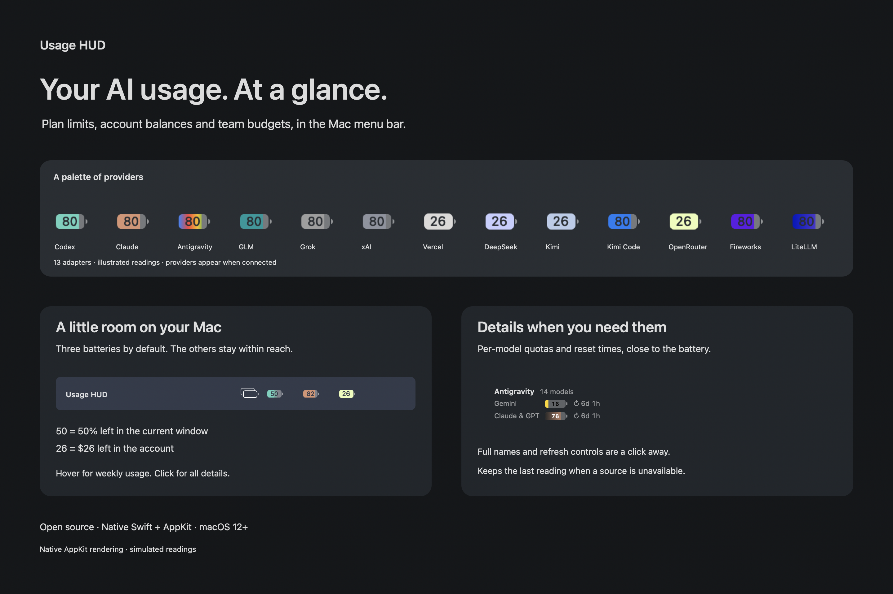

# Usage HUD

A little room for your AI usage, right in the Mac menu bar.



*Visual study rendered by the app. Readings are simulated; provider adapters have different live-account coverage. See [product-test evidence](PRODUCT_TEST.md).*

I wanted to see how much Codex and Claude I had left without opening another window. Usage HUD puts that information inside a few small batteries, borrowing the familiar shape of the Mac’s own battery icon. OpenRouter sits beside them with its dollar balance.

Built for macOS, entirely in Swift. Small enough to stay out of the way.

## Reading the batteries

Using Codex Pro or Claude Pro/Max? [Here’s how your plan is displayed and how to set it up](PAID_PLANS.md). The same app adapts to your account’s reported windows.

Each provider has its own color: teal for Codex (its 7d layer a muted teal), terracotta for Claude, poison green for OpenRouter, turquoise for GLM, Google's four colours for Antigravity, slate for Grok, warm grey for Vercel, DeepSeek's whale blue, Kimi's azure (Kimi Code too), Fireworks purple, LiteLLM blue-to-purple, and xAI graphite blue.

For Codex and Claude, the number is the **percentage remaining** in your 5-hour window. The stronger color follows that reading. Behind it, a lighter shade shows what remains for the week. Grey is the unused part of the battery. The digits are cut out of the fill, so your menu-bar background shows through, just like the reference Mac battery. When the week has less left than the 5-hour window, the 5-hour fill covers it: hover over a battery to see the weekly reading on its own, in that same lighter shade. It returns to the 5-hour view when the pointer moves away.

If the 5-hour reading is unavailable or its window has reset, the battery falls back to the latest 7-day reading. Older readings look dimmer, and the menu tells you when you’re seeing cached information. Click any battery to see the individual windows, reset times, and refresh controls.

OpenRouter shows **dollars left**. Its lime body gives the balance a readable home; the digits are the balance, and the body is as full as your tightest capped key (full when no key has a cap). Under $15 the body turns the Mac battery's yellow, and under $10 it breathes a faint red once, because OpenRouter caps free models at 50 requests a day until $10 has been bought. Whole amounts keep the standard battery size; cents stretch the body to fit. Any OpenAI API credit estimate lives separately in the Codex menu.

By default, at most three provider batteries sit in the menu bar to limit the space the HUD takes. The HUD learns which tools you use most and keeps those, whatever your main tools are, so one you only tried today doesn't push them out; the most used one takes the first spot when the app starts. The rest fold into a small **stacked-battery** item, and resting the pointer on it opens their batteries and menus. To show more or fewer, run `defaults write local.usage-hud visibleBatteries 4`.

Model hover keeps the existing 5h-to-7d battery change and adds only a small monochrome identifier when a suitable template is available from an installed app. Missing templates retain the provider tooltip; full names remain in the click menu. Aggregator/infra and Antigravity keep their quota tables.

Antigravity's battery and pool cells carry their model-family palette: Google/Gemini colors for Google models, black/charcoal blended with Claude's earth tone for Claude & GPT. The main battery follows the recently used pool and its palette; unknown families receive a neutral fill. Detail warnings retain yellow/red, and an exhausted 5h or 7d window can warn even if the other window has capacity.

Detailed key/pool/budget cells use the same layout in hover panels and overflow submenus. Their healthy fill is white on a dark menu bar and black on a light menu bar, with yellow/red warnings for low headroom. Sources that report only a balance keep their currency reading.

On a light menu bar the batteries switch to dark outlines, and every colour stays deep enough never to pass for the Mac's own battery. Claude's extra usage (spent, cap, or Off) appears in the hover text with any other money rows.

A battery that needs you breathes a soft red: a key rejected or signed out, an OpenRouter key near its cap, or a balance under $1 (change it with `defaults write local.usage-hud lowBalance 5`). Hover over it to read why; it stays calm until something new happens. OpenRouter keys show their own daily, weekly or monthly cap and when it resets, counted in UTC like OpenRouter itself, with the key closest to its cap first.

OpenRouter needs no setup: keys you already keep in your shell profile, AI tool configs or `.sh` scripts are found and named after their variable (`ALICE_OPENROUTER_KEY` becomes "alice") or their file (`boot-alice.sh` becomes "boot-alice"). A management key kept the same way is recognised by itself, so OpenRouter teams need nothing else: hovering the battery then opens a small panel with the account balance, a summary like "23 keys · $41.20 today · 3 near cap", and the keys closest to their caps as rows of cells. The full list sits under **All keys** in the menu. See [PROVIDERS.md](PROVIDERS.md).

After startup, a newly connected source gets a small notice below the HUD’s batteries. It says where its fresh reading came from, groups simultaneous changes, and disappears after six seconds without sound or taking focus. Confirmed removals get the same treatment. Ordinary refreshes, cached readings, temporary outages, model-list changes and restarting the app stay quiet; there is nothing to dismiss or configure.

When a newer release is published on GitHub, every battery menu offers **Update available**. Usage endpoints change without notice, so this is how fixes reach you.

## Make it at home on your Mac

You’ll need macOS 12 or later and Xcode Command Line Tools to build the app. For subscription usage, sign in through the standalone Codex CLI (`~/.local/bin/codex`) and Claude Code. You can use Usage HUD without the Codex or Claude desktop apps; their CLI tools and sign-ins still need to be available.

```bash
git clone https://github.com/HotDogAmbulance/usage-hud.git
cd usage-hud
./install.sh --launch
```

That installs the app in `~/Applications`. If you prefer keeping it on your Desktop:

```bash
./install.sh --dest "$HOME/Desktop" --launch
```

The installed app carries its own executable, so you can remove the source checkout afterwards. Your settings and cached readings stay in the private `~/.usage-hud` folder. Set `USAGE_HUD_HOME` if you’d like to keep them somewhere else.

If you’re coming from the older Python version, the installer keeps your existing configuration and readings.

When Claude Code is on the Mac, the app adds three small hooks (session start, each prompt, each finished turn) and its statusline to `~/.claude/settings.json`, keeping a backup the first time and leaving everything else, including a statusline of your own, as it was. Hooks only notify the running HUD of activity; they do not carry quota values or renew credentials, and a hook never opens a Keychain prompt. The statusline command receives quota values when Claude Code runs it. Hook execution alone therefore does not guarantee fresh readings. If Claude Code is removed and installed again later, the app adds them back by itself. Claude’s connection and refresh controls are temporarily hidden while Desktop quota delivery is unresolved. Automatic reads and existing hooks still run; cached readings and their source errors remain visible. Deleting the app leaves its hooks silent.

## A few things to know

Codex and Claude refresh in the background every five minutes. OpenRouter and the other key-based providers refresh in the background too; OpenAI API credit estimates refresh when you ask for them from the menu. The display checks its local cache every 30 seconds.

Credentials stay in your existing macOS Keychain, CLI sign-in stores or provider configuration. Usage HUD reads them when needed and holds tokens in memory for the corresponding requests; it does not copy them into its usage cache. It doesn’t change your Keychain entries or send app telemetry. If the Claude Code credential expires (it lasts about eight hours, and Claude Code renews it only when it makes a request), the last reading stays visible as cached.

**Renewing an expired Claude sign-in.** When the credential has expired, Usage HUD asks your own `claude` command for one tiny request (the cheapest model, no tools, `--no-session-persistence`, in `~/.usage-hud/renew`), and Claude Code renews itself the way it always does. Usage HUD never reads or writes the token for this and does not identify itself as another client. It costs roughly 7,000 tokens, well under a cent at API prices. It happens only while the credential is expired, at most once every six hours after a success (half an hour after a failure), and not more than three times in a row without Claude Code reporting real use in between. Each renewal shows a notice and adds a line to `~/.usage-hud/renewals.log`. Claude Code can still leave an empty `memory` folder under `~/.claude/projects` for that directory; Usage HUD removes that one folder, and only that one, afterwards and logs how many items it removed. To turn this off: `touch ~/.usage-hud/no-auto-renew`. In a reported macOS test, hours in Desktop’s Code tab did not renew the Keychain credential used by the HUD; running the CLI did. This observation does not establish which credential store Desktop used, or guarantee the same behaviour in every version. Desktop statusline execution has not been verified by this project, so Desktop activity alone should not be treated as proof that the HUD is receiving current quota.

**Claude limit resets.** Usage HUD currently does not display Claude’s redeemable limit-reset grants. These grants are separate from the scheduled reset times of usage windows. Claude Code’s [documented statusline payload](https://code.claude.com/docs/en/statusline#available-data) provides usage-window information, but does not currently document grant counts, types or expiries. Usage HUD removed its experimental grant-reading path and will not identify itself as another client to obtain this information. If Anthropic exposes grant metadata through a documented interface, Usage HUD can add a display-only indicator. Redemption will remain in Anthropic’s own interface. Codex’s reset credits are a separate feature obtained from its existing quota response.

Claude collection currently combines statusline readings with OAuth usage and prepaid-balance requests; it is not statusline-only. The statusline is a documented data interface, while the OAuth endpoints used here are not a published third-party usage API. Anthropic’s [authentication and credential-use policy](https://code.claude.com/docs/en/legal-and-compliance#authentication-and-credential-use) is relevant to that distinction.

The Claude usage endpoint can change, and an API credit estimate may differ from your final bill. The estimate supports a pinned set of tariffs and stops when it encounters an unsupported model or service tier. Your provider’s billing page is the place to check the final amount.

## If you’d like to work on it

The app has no third-party packages or interpreter to install. The code is split into a small AppKit interface and a shared Swift core, with a provider protocol so another service can have its own adapter.

| Where | What lives there |
| --- | --- |
| `Sources/UsageHUD` | Battery drawing, menus, and app lifecycle |
| `Sources/UsageHUDCore` | Models, cache, provider protocol, networking, and CLI |
| `Providers.swift` | Codex, Claude, and OpenRouter adapters |
| `Antigravity.swift` | Local Antigravity model quotas, using the app’s own session |
| `CodingPlans.swift` | Optional GLM and Grok adapters, shown once signed in |
| `Balances.swift` | `KeyProvider`: every provider read with an API key (Vercel, DeepSeek, Kimi, Kimi Code, xAI, Fireworks, LiteLLM) |
| `OpenAICredits.swift` | Separate API credit accounting |
| `Tests` | Native Swift checks |

Only one refresh runs at a time. Missing windows retain their previous readings and timestamps, and shared cache writes use a lock so the app and Claude hooks can work together. Codex reads quota through `account/rateLimits/read` in its standalone app-server, without starting an inference session. Claude reads its usage endpoint with the existing Claude Code OAuth token.

[PROVIDERS.md](PROVIDERS.md) explains provider configuration and how to add an adapter.

These commands are handy for checking readings or working on the app:

```bash
~/.usage-hud/usagehud --json
~/.usage-hud/usagehud --refresh automatic
~/.usage-hud/usagehud --refresh openrouter
~/.usage-hud/usagehud --refresh openai-credits
swift run usagehud-tests
swift run usagehud --self-test
swift build --configuration release --product usagehud
```

The `--claude-statusline` command also keeps the context cache used by existing Claude burn guards. `--probe-if-stale` is what the hooks run: it asks the running app to read Claude. `--disconnect-claude-code` removes the hooks.

## When you want to remove it

```bash
./uninstall.sh
```

To remove the cached readings and provider configuration as well:

```bash
./uninstall.sh --purge
```

The uninstaller also takes Usage HUD’s hooks out of Claude Code’s settings. Your provider credentials stay in the Keychain.

Usage HUD is available under the [MIT license](LICENSE). Make it your own.

For development UI testing without accounts, build and run `.build/debug/usagehud --product-test`. This uses the normal drawing and menus with simulated readings; Refresh supplies a fresh fixture. See [PRODUCT_TEST.md](PRODUCT_TEST.md) for verified behavior and remaining live-account checks.
